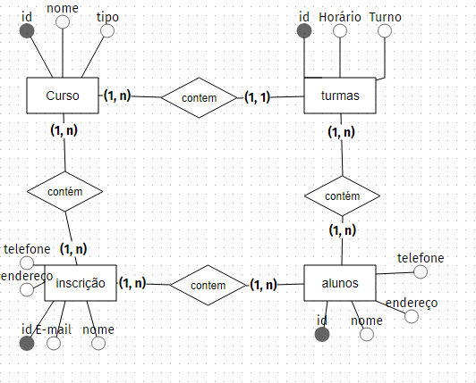

<h3>
    Modelo do projeto
</h3>

<h1>Para apoiar nesse sistema recebemos a tarefa de realizar essa modelagem
    e responder algumas perguntas com nosso modelo:
    
   
    ⇨ Existem outras entidades além dessas três?
    
    Sim.  Iscrição
    
    ⇨ Quais são os principais campos e tipos?
    
    inscrição: id, endereço, telefone, e-mail, nome

    curso: id, nome,tipo 
    
    alunos: id, nome, telefone, endereço
    
    turma: id, horário, Turno
    
    
    ⇨ Como essas entidades estão relacionadas?
    curso contem turmas comtem alunos 
    contem iscrição contem curso
</h1>

<h3>
    O que foi utilizado para fazer o projeto:
</h3>

<ul>
    www.brmodeloweb.com
</ul>